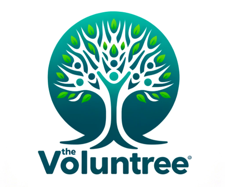
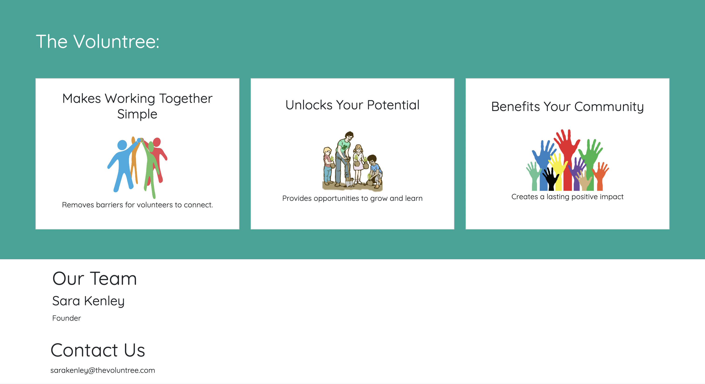
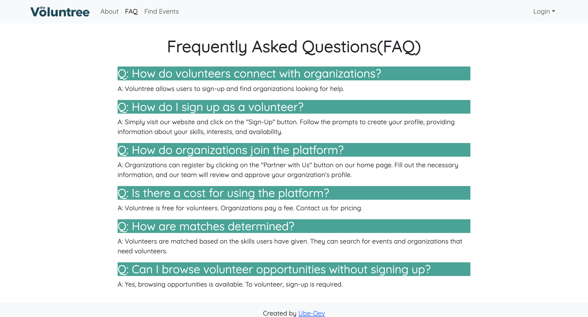

# Ube-Dev

## Table of Contents
* [Voluntree Overview](#overview)
* [Goals](#goals)
* [Application Design](#application-design)
* [Developer Guide](#developer-guide)
  * [Continuous Integration](#continuous-integration)
  * [Installation](#installation)
* [Development History](#development-history)
* [Team](#team)

## Overview

1. Voluntree Proof Of Concept: [Voluntree](#) 

### What Is Voluntree?

Voluntree is a volunteer management system that helps match willing volunteers with nonprofits, and other organizations. Currently, there is no easy way for volunteers to find organizations that need their help. Voluntree aims to solve this problem by providing a platform for organizations to post their volunteer opportunities and for volunteers to find them. Voluntree is a web application that is accessible from any device with a web browser.

## Goals

Voluntree aims to provide the following features:
* Account Registration
* Volunteer Profile
* Organization Profile
* Volunteer Opportunities Posting
* Volunteer Opportunities Search
* Volunteer Opportunities committing
* Communication between Volunteers and Organizations

## Application Design
The following describes the design process of our app:

### Landing Page Mockup
This is the page that all users will go to when they first visit the site. 

### Register/Login Page
Users can then choose to sign in or sign up through the dropdown at the top right, or by clicking the Sign In or Register buttons on the landing page. 

### Home Page Mockup
After logging in, users will see the home page, where they get to see a brief overview of their dashboard and stats. They also see the event search bar, where they can search for events. 

#### M2 Update:
With this iteration of the home page, users will now be able to see information about themselves, the number of hours volunteered, and change their profile picture. A working calendar is now implemented to show future events the user has signed up for.

### About Us Page
The about page shows the users what Voluntree's mission is, as well as contact information.

#### M2 Update:
The about us page allows users to submit inquiries through a built-in form, eliminating the hassle of going through a separate app to contact the team.

### FAQ Page
Here, the users can see any frequently asked questions, and get quick answers to help them better understand how the site and Voluntree operates. 

#### M2 Update:
The FAQ page has changed to have slightly different styling.

### Events Page Mockup
In the events page, users can see all available events laid out in card form, with additional information such as skills required to help out at the event, as well as the button to actually join the event. 

#### M2 Update:
The new and improved events page allows for a functional search bar to filter through events by keywords. The event cards now also are more uniformly sized and allow space for a cover picture.

### Dashboard Page Mockup
Lastly, users can go to the dashboard page for a detailed chart of their stats and performances 

## Developer Guide

### Continuous Integration

The Voluntree uses GitHub Actions to automatically run ESLint and TestCafe each time a commit is made to the default branch. You can see the results of all recent “workflows” at https://github.com/Ube-Dev/Voluntree/actions.

### Installation

First, install Meteor.

Second, visit the [Voluntree](https://github.com/Ube-Dev/Voluntree) application GitHub page, and click the “Use this template” button to create your own repository initialized with a copy of this application. Alternatively, you can download the sources as a zip file or make a fork of the repo. However you do it, download a copy of the repo to your local computer.

Third, in your terminal cd into the Voluntree/app directory and install libraries with:

> $ meteor npm install

Fourth, run the system with:

> $ meteor npm run start

If all goes well, the application will appear at http://localhost:3000.

## Development History

The following describes the development process of our app:

### Milestone 1: Basic User Needs and Page Mockups
The goal of milestone 1 was to create a work flow for the app to identify its main features to solve the problem of matching volunteers with organizations. We focused on creating a mockup of the app’s UI and database.

Milestone 1 was managed using [Voluntree GitHub Project Board M1](https://github.com/orgs/Ube-Dev/projects/1/views/2)

### Milestone 2: Databases and Rendering
Further implementation of the databases of events and users were the forefront of this milestone. Being able to display default events and understanding how to create, update, and remove certain items in the collections allowed us to have a more functioning website.

Milestone 2 was managed using [Voluntree GitHub Project Board M2](https://github.com/orgs/Ube-Dev/projects/3)

## Team
Volntree is designed and developed by:

|                                                                                                                     | Name        | Role                         | GitHub Handle   |
|---------------------------------------------------------------------------------------------------------------------|-------------|------------------------------|-----------------|
|   | Thomas Rivera | Chief Solutions Architect    | @thomasarivera  |
|  | Sierra Morales | UX Dev and Design Lead       | @sierranmorales |
|      | Alden Paroni | Development Lead             | @aldenparoni    |
|       | Jiawen Chen | Database Lead                | @Jchen20-1      |
|       | Jianle Liu  | Integrations Lead            | @jianleliu      |
|      | HokWai Chan | Testing Lead                 | @hokwaichan     |
|      | Ryan Seng   | Systems Reliability Engineer | @ryanseng32     |
|   | William Simmons | Scrum-Master                 | @willjsimmons   |

 
All members of this team have agreed to abide by the following [contract](https://docs.google.com/document/d/1Kxjdgpj1TOGy7MWezyQWSatDHok7aZ1TTr7NwqdHbww/edit?usp=sharing).

## Team Goals

- Work together as a team and contribute equitably.
- Design a user-friendly and intuitive applications.
- Create a thoughtful projects that help to bring people together.

## Meetings and Communication

The team meets biweekly at a minimum and official Communications are disseminated via project group's Discord server. The team also leverages Github projects as a means of organizing and assigning tasks.

## Contact

Please email [wjs7@hawaii.edu](wjs7@hawaii.edu) for any inquiries.

---
<!---------------------------------------------------------------------------->

