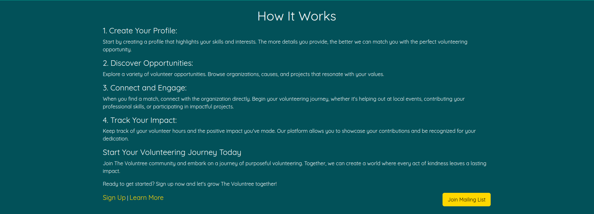

# Ube-Dev

## Table of Contents
* [Voluntree Overview](#overview)
* [Goals](#goals)
* [User Guide](#user-guide)
* [Organization Guide](#organization-guide)
* [Developer Guide](#developer-guide)
  * [Continuous Integration](#continuous-integration)
  * [Installation](#installation)
* [Development History](#development-history)
* [Team](#team)

## Overview

1. Voluntree Proof Of Concept: [Voluntree](https://github.com/Ube-Dev/Voluntree) 

### What Is Voluntree?

Voluntree is a volunteer management system that matches willing volunteers with nonprofits, and other organizations. Currently, there is no easy way for volunteers to find organizations that need their help. Voluntree aims to solve this problem by providing a platform for organizations to post their volunteer opportunities and for volunteers to find them. Voluntree is a web application that is accessible from any device with a web browser.

## Goals

Voluntree aims to provide the following features:
* Account Registration
* Volunteer Profile
* Organization Profile
* Volunteer Opportunities Posting
* Volunteer Opportunities Search
* Volunteer Opportunities committing
* Communication between Volunteers and Organizations
* Organization statistics

## User Guide
This section provides a walkthrough of the Voluntree web app including its user interface and its capabilities.

### Landing Page
The landing page is presented to users when they first visit the site. It provides a brief overview and purpose of the app. It encourages the user to sign-up, log-in, or explore the events page to get started. A mailing list button is also available for users to subscribe to the Voluntree newsletter.

### About Us Page
The about page shows the users what Voluntree's mission is, and how it can help their community. It provides contact information and a message form for users to reach out to the team.

### Subscribe Page
The subscribe page promotes and encourages users to become a member and donate to the Voluntree.

### FAQ Page
Here, users can see any frequently asked questions, and get quick answers to better understand how the app and Voluntree operates.

### Find Events Page
Without needing to log in, users can freely browse available events. To join an event, users can click on the event card and click the "Commit" button. If not logged in, they will be prompted to log in or register. Events can be searched for by name, location, organization, or description. A filter is also available to sort events by categories such as "Environmental Conservation." To maintain focus, search results are limited to 9 events and uses pagination to navigate through the results. At the bottom, users can create their own events by signing up as an Organization.

### Event Page
After selecting an event, users are taken to the event page. Here, they can see event details, location, and organization. They can also see the event's description, date, and time. Users can also commit to the event and have a quick contact button to reach out to the organization.

### Register/Login Page
Users can then choose to sign in or sign up through the dropdown at the top right, or by clicking the Sign In or Register buttons on the landing page. During registration, users must agree to the terms of service before proceeding. If not accepted, users will not be able to register.

### Home Page
After logging in, users will see the home page. They have access to a brief overview of their dashboard and stats. They can also see their upcoming events and a calendar of events. Easy access to the events page and user profile is also available. A "Log Hours" button is also available for users to log their volunteer hours.

### Logging Hours
Users can log their volunteer hours by clicking the "Log Hours" button on the home page. Displayed will be a QR code that can be scanned by the organization to log the hours.

### User Profile Page
Users can view and edit their profile. They can see their stats, committed events, and their organization if they have one. They can also edit their profile information and change their password.

### Edit User Profile Page
Users can edit their profile information.

## Organization Guide

### Create Organization Page
Users can create an organization and fill out the necessary information to get started.

### Dashboard Page
Users with organizations can go to the dashboard page for a detailed overview of their stats and performances. It displays information about the organization and has access to edit and view thier organization profile. They can also see their upcoming events along with simple access to editing and user recording.

### Add Event Page
Organizations can create new events which will show up on the Find Events Page for users to browse through. They can fill out the event information and add a description, date, time, and location. Host details and contact information are automatically filled out based on the selected organization. Each section of the form is split into section to help make the process easier.

### Edit & Delete Event Page
Organizations can edit and delete events they have created. They can change the event information and delete the event if necessary.

### Recording Hours Page
Organizations can record the hours of volunteers who have attended their events. They can scan the QR code of the volunteer to log their hours.

## Developer Guide

### Continuous Integration

The Voluntree uses GitHub Actions to automatically run ESLint and TestCafe each time a commit is made to the default branch. You can see the results of all recent “workflows” at https://github.com/Ube-Dev/Voluntree/actions.

### Installation

First, install Meteor.

Second, visit the [Voluntree](https://github.com/Ube-Dev/Voluntree) application GitHub page, and click the “Use this template” button to create your own repository initialized with a copy of this application. Alternatively, you can download the sources as a zip file or make a fork of the repo. However you do it, download a copy of the repo to your local computer.

Third, in your terminal cd into the Voluntree/app directory and install libraries with:

> $ meteor npm install

Fourth, run the system with:

> $ meteor npm run start

If all goes well, the application will appear at http://localhost:3000.

## Development History

The following describes the development process of our app:

### Milestone 1: Basic User Needs and Page Mockups
The goal of milestone 1 was to create a work flow for the app to identify its main features to solve the problem of matching volunteers with organizations. We focused on creating a mockup of the app’s UI and database.

Milestone 1 was managed using [Voluntree GitHub Project Board M1](https://github.com/orgs/Ube-Dev/projects/1/views/2)

### Milestone 2: Databases and Rendering
Further implementation of the databases of events and users were the forefront of this milestone. Being able to display default events and understanding how to create, update, and remove certain items in the collections allowed us to have a more functioning website.

Milestone 2 was managed using [Voluntree GitHub Project Board M2](https://github.com/orgs/Ube-Dev/projects/3)

### Milestone 3: Event Commitment and Creation
The third milestone was focused on the ability for users to commit to events and for organizations to create events. Improvements to overall user experience and user interface were also made. Users can now view and edit profiles and committed events.

Milestone 3 was managed using [Voluntree GitHub Project Board M3](https://github.com/orgs/Ube-Dev/projects/5)

### Milestone 4: Organization Creation, UI improvements, and Bug Fixes
The fourth milestone was focused on the ability for users to create organizations and for organizations to view their dashboard. Improvements to overall user experience and user interface were also made.

Milestone 4 was managed using [Voluntree GitHub Project Board M4](https://github.com/orgs/Ube-Dev/projects/9/views/1)

### Milestone 5: Organizations, Events, and User Sign Up
The fifth milestone was focused on the ability for users to sign-up after accepting a TOS and organizations to create, edit, and delete events. Improvements to overall user experience and user interface were also made.

Milestone 5 was managed using [Voluntree GitHub Project Board M5](https://github.com/orgs/Ube-Dev/projects/10/views/1)

## Team
Voluntree is designed and developed by:

|                                                                                                                     | Name            | Role                         | GitHub Handle   |
|---------------------------------------------------------------------------------------------------------------------|-----------------|------------------------------|-----------------|
|   | Thomas Rivera   | Chief Solutions Architect    | @thomasarivera  |
|  | Sierra Morales  | UX Dev and Design Lead       | @sierranmorales |
|      | Alden Paroni    | Development Lead             | @aldenparoni    |
|       | Jiawen Chen     | Database Lead                | @Jchen20-1      |
|       | Jianle Liu      | Integrations Lead            | @jianleliu      |
|      | HokWai Chan     | Testing Lead                 | @hokwaichan     |
|      | Ryan Seng       | Systems Reliability Engineer | @ryanseng03     |
|   | William Simmons | Scrum-Master                 | @willjsimmons   |

 
All members of this team have agreed to abide by the following [contract](https://docs.google.com/document/d/1Kxjdgpj1TOGy7MWezyQWSatDHok7aZ1TTr7NwqdHbww/edit?usp=sharing).

## Team Goals

- Work together as a team and contribute equitably.
- Design a user-friendly and intuitive applications.
- Create a thoughtful projects that help to bring people together.

## Meetings and Communication

The team meets biweekly at a minimum and official Communications are disseminated via project group's Discord server. The team also leverages Github projects as a means of organizing and assigning tasks.

## Contact

Please email [wjs7@hawaii.edu](wjs7@hawaii.edu) for any inquiries.

---
<!---------------------------------------------------------------------------->
